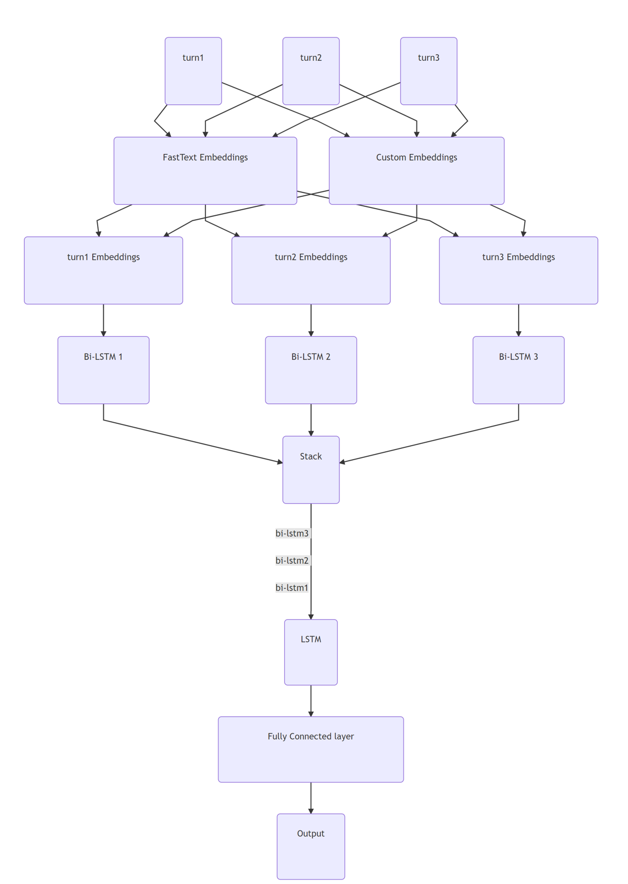

# EmoContext - Task Report

> I've noticed that quite a few people have starred or forked this repository. I dont' remember much of the work I had done for this, but I do remember that everything I had messed around after december 13th more or less ended up worsening performance. If you are interested in what I have done here it might be best if you go through the commit history and find a version around December 2018 and work from there.

- **Student email:** ddhamani@uncc.edu

## Table of Contents

- [EmoContext - Task Report](#emocontext---task-report)
  - [Table of Contents](#table-of-contents)
  - [Introduction](#introduction)
    - [Description](#description)
    - [Data](#data)
  - [Methodology](#methodology)
    - [Justification](#justification)
  - [Evaluation (as of 13th December, 2018. 12:30 pm)](#evaluation-as-of-13th-december-2018-1230-pm)
  - [Discussion and Future Plans](#discussion-and-future-plans)
    - [Text Data Augmentation](#text-data-augmentation)
  
## Introduction

When you read, "Why don't you ever text me", does it conveys an angry emotion or sad emotion?

Understanding Emotions in Textual Conversations is a hard problem in absence of voice modulations and facial expressions. The shared task, "EmoContext" is designed to invite research in this area.

### Description

In this task, you are given a textual dialogue i.e. a user utterance along with two turns of context, you have to classify the emotion of user utterance as one of the emotion classes: `happy`, `sad`, `angry` or `others`. ​

### Data

The training data set contains `15K` records for emotion classes i.e., `happy`, `sad`, and `angry` combined. It also contains `15K` records not belonging to any of the aforementioned emotion classes. For Test Data,  `2703` records of unlabelled data is provided to be used to evaluate models we create. Final testing would be done on as of yet unreleased data.

Examples from the dataset -

| turn1 	| turn2 	| turn3 	| label 	|
|-----------------------------------------	|-----------------------------------------------------	|---------------------	|--------	|
| Don't worry  I'm girl 	| hmm how do I know if you are 	| What's ur name? 	| others 	|
| When did I? 	| saw many times i think -_- 	| No. I never saw you 	| angry 	|
| Money money and lots of money😍😍  	| I need to get it tailored but I'm in love with it 😍 	| 😁😁  	| happy 	|
| Bcoz u dont know wat is to miss someone 	| but sometimes one can't express the same 	| 😢 	| sad 	|

Each `turn` here represents a text message in a conversation between two parties. Note that `turn1` and `turn3` are texts sent by an anonymous person, while `turn2` is a text reply sent by [Ruuh](https://blogs.msdn.microsoft.com/msind/2018/07/12/ruuh-ai-image-recognition/), a AI-based chatbot.

> It is important to note that the task requires us to predict the emotion exhibited only in the last text message, `turn3`, and not the entire conversation. If the sender is angry in the first text message but calms down by the last text message the label prediction is not expected to be angry.

## Methodology

The approach used was a standard one for these sort of short text classification tasks - pre-trained word vectors in conjunction with LSTMs - modified to fit the unique challenges in this task.

Final architecture of the Neural Network

### Justification

Pre-trained word embeddings + Bi-LSTMs are what is usually used in state of the art text classification systems, so it's choice doesn't need much justification.

3 different Bi-LSTMs were  used for each turn as show in the above diagram, because I felt different representations are needed for each turn, especially considering that they are not equivalent. This hypothesis worked out well in practice, taking me from an F1 of `0.64` to `0.66` upon making the switch on the evaluation dataset.

Custom embeddings were trained and used because our corpus had a lot of textual (such as `:(`, `:p`, etc.) and unicode emojis (`😍`, `😁`, etc.). FastText did not have good vectors for these - a nearest neighbour search for these words using the fasttext embeddings revealed that fasttext's representations for these words are mostly nonsensical.

## Evaluation (as of 13th December, 2018. 12:30 pm)

I didn't write proper code to plot graphs for testing and training loss curves, and thusly made random guesses on how many epochs to run the network for. This almost certainly means that my network is either under-fitting or over-fitting, my guess would be over-fitting.

Regardless, training of the network wasn't done using best practices, something that I plan to correct in the near future. Even so, the best F1 score I received was `0.703108` which meant a rank of `44` on the leaderboard, of the total `241` participants.

That puts me at approximately the top-20th percentile (`18.25%`) in the competition. The live leaderboard can be found [here](https://competitions.codalab.org/competitions/19790#results).

A table of all of my submisions made to the server is shown below.

| # 	| SCORE 	| FILENAME 	| SUBMISSION DATE 	| STATUS 	|
|----	|----------	|--------------	|---------------------	|-----------	|
| 1 	| --- 	| test.zip 	| 09/21/2018 02:23:57 	| Finished 	|
| 2 	| --- 	| test.zip 	| 09/21/2018 02:23:57 	| Finished 	|
| 3 	| 0.359338 	| test.zip 	| 09/21/2018 02:34:49 	| Finished 	|
| 4 	| 0.491269 	| test.zip 	| 09/27/2018 18:25:19 	| Finished 	|
| 5 	| 0.54375 	| test.zip 	| 09/27/2018 18:34:09 	| Finished 	|
| 6 	| 0.488522 	| test.zip 	| 09/28/2018 02:36:23 	| Finished 	|
| 7 	| 0.488522 	| test.zip 	| 09/28/2018 02:47:14 	| Finished 	|
| 8 	| 0.511581 	| test.zip 	| 09/28/2018 02:59:29 	| Finished 	|
| 9 	| 0.525054 	| test.zip 	| 09/28/2018 03:06:21 	| Finished 	|
| 10 	| 0.525054 	| test.zip 	| 09/28/2018 03:06:22 	| Finished 	|
| 11 	| 0.525054 	| test.zip 	| 09/28/2018 03:08:35 	| Finished 	|
| 12 	| 0.527421 	| test.zip 	| 09/28/2018 03:10:09 	| Finished 	|
| 13 	| 0.517467 	| test.zip 	| 09/28/2018 03:13:44 	| Finished 	|
| 14 	| 0.554278 	| test.zip 	| 10/13/2018 19:02:52 	| Finished 	|
| 15 	| 0.554278 	| test.zip 	| 10/13/2018 19:02:53 	| Finished 	|
| 16 	| 0.574772 	| test.zip 	| 10/13/2018 20:07:57 	| Finished 	|
| 17 	| --- 	| test.zip 	| 11/08/2018 17:18:47 	| Submitted 	|
| 18 	| --- 	| test.zip 	| 11/08/2018 18:07:28 	| Running 	|
| 19 	| --- 	| test.zip 	| 11/15/2018 15:27:47 	| Finished 	|
| 20 	| 0.439024 	| test.zip 	| 11/15/2018 16:22:39 	| Finished 	|
| 21 	| 0.452756 	| test.zip 	| 11/15/2018 16:48:59 	| Finished 	|
| 22 	| 0.541096 	| test.zip 	| 11/17/2018 14:57:02 	| Finished 	|
| 23 	| 0.541096 	| test.zip 	| 11/17/2018 19:39:13 	| Finished 	|
| 24 	| 0.471014 	| test.zip 	| 11/17/2018 19:40:10 	| Finished 	|
| 25 	| 0.495238 	| test.zip 	| 11/17/2018 19:56:02 	| Finished 	|
| 26 	| 0.472597 	| test.zip 	| 11/17/2018 20:03:42 	| Finished 	|
| 27 	| 0.488593 	| test.zip 	| 11/17/2018 20:14:58 	| Finished 	|
| 28 	| 0.573643 	| test.zip 	| 11/25/2018 01:35:56 	| Finished 	|
| 29 	| 0.624481 	| test.zip 	| 11/25/2018 01:55:35 	| Finished 	|
| 30 	| 0.572973 	| test.zip 	| 11/25/2018 02:14:25 	| Finished 	|
| 31 	| 0.607109 	| test.zip 	| 11/25/2018 02:48:27 	| Finished 	|
| 32 	| 0.604374 	| test.zip 	| 11/25/2018 03:23:21 	| Finished 	|
| 33 	| 0.596899 	| test.zip 	| 11/25/2018 03:43:54 	| Finished 	|
| 34 	| 0.5941 	| test.zip 	| 11/25/2018 04:03:46 	| Finished 	|
| 35 	| 0.568841 	| test.zip 	| 11/25/2018 04:19:53 	| Finished 	|
| 36 	| 0.578999 	| test.zip 	| 11/25/2018 04:49:15 	| Finished 	|
| 37 	| 0.59434 	| test.zip 	| 11/25/2018 05:08:22 	| Finished 	|
| 38 	| 0.622047 	| test.zip 	| 11/25/2018 05:30:01 	| Finished 	|
| 39 	| 0.596262 	| test.zip 	| 11/25/2018 06:03:08 	| Finished 	|
| 40 	| 0.619487 	| test.zip 	| 11/25/2018 06:35:30 	| Finished 	|
| 41 	| 0.585782 	| test.zip 	| 11/25/2018 17:51:26 	| Finished 	|
| 42 	| 0.619808 	| test.zip 	| 11/25/2018 18:27:06 	| Finished 	|
| 43 	| 0.619958 	| test.zip 	| 11/25/2018 22:39:42 	| Finished 	|
| 44 	| 0.664688 	| test.zip 	| 11/25/2018 23:05:23 	| Finished 	|
| 45 	| 0.670577 	| test.zip 	| 11/25/2018 23:23:08 	| Finished 	|
| 46 	| 0.667333 	| test.zip 	| 11/26/2018 00:37:52 	| Finished 	|
| 47 	| 0.66997 	| test.zip 	| 11/26/2018 01:07:52 	| Finished 	|
| 48 	| 0.672878 	| test.zip 	| 11/26/2018 02:21:29 	| Finished 	|
| 49 	| 0.664024 	| test.zip 	| 11/26/2018 02:44:03 	| Finished 	|
| 50 	| 0.694268 	| test.zip 	| 11/26/2018 03:15:21 	| Finished 	|
| 51 	| 0.64813 	| test.zip 	| 11/26/2018 03:55:27 	| Finished 	|
| 52 	| 0.647564 	| test.zip 	| 11/26/2018 04:34:42 	| Finished 	|
| 53 	| 0.668016 	| test.zip 	| 11/26/2018 05:07:59 	| Finished 	|
| 54 	| 0.658359 	| test.zip 	| 11/26/2018 15:05:05 	| Finished 	|
| 55 	| 0.665335 	| test.zip 	| 11/26/2018 16:33:20 	| Finished 	|
| 56 	| 0.672619 	| test.zip 	| 11/26/2018 21:37:31 	| Finished 	|
| 57 	| 0.703108 	| test.zip 	| 11/26/2018 22:11:04 	| Finished 	|
| 58 	| 0.675877 	| test.zip 	| 11/26/2018 22:46:43 	| Finished 	|
| 59 	| 0.690155 	| test.zip 	| 11/26/2018 23:29:15 	| Finished 	|
| 60 	| 0.674822 	| test.zip 	| 11/27/2018 01:19:46 	| Finished 	|
| 61 	| 0.69239 	| test.zip 	| 11/27/2018 01:56:31 	| Finished 	|
| 62 	| 0.680585 	| test.zip 	| 11/27/2018 16:14:26 	| Finished 	|
| 63 	| 0.664039 	| test.zip 	| 11/27/2018 17:03:21 	| Finished 	|
| 64 	| 0.688797 	| test.zip 	| 11/27/2018 17:35:20 	| Finished 	|
| 65 	| 0.670695 	| test.zip 	| 11/27/2018 18:01:05 	| Finished 	|
| 66 	| 0.666667 	| test.zip 	| 11/27/2018 19:47:04 	| Finished 	|
| 67 	| 0.676768 	| test.zip 	| 11/27/2018 20:24:30 	| Finished 	|
| 68 	| 0.67019 	| test.zip 	| 11/27/2018 23:51:44 	| Finished 	|
| 69 	| 0.695652 	| test.zip 	| 11/28/2018 02:59:22 	| Finished 	|
| 70 	| 0.678173 	| test.zip 	| 11/28/2018 03:41:32 	| Finished 	|
| 71 	| 0.685773 	| test.zip 	| 11/28/2018 04:44:13 	| Finished 	|
| 72 	| 0.660194 	| test.zip 	| 11/28/2018 05:13:12 	| Finished 	|
| 73 	| 0.67686 	| test.zip 	| 11/28/2018 10:49:08 	| Finished 	|
| 74 	| 0.697725 	| test.zip 	| 11/28/2018 14:30:33 	| Finished 	|
| 75 	| 0.674067 	| test.zip 	| 11/28/2018 15:58:40 	| Finished 	|
| 76 	| 0.690476 	| test.zip 	| 11/28/2018 17:13:31 	| Finished 	|
| 77 	| 0.67551 	| test.zip 	| 11/28/2018 18:49:43 	| Finished 	|
| 78 	| 0.082073 	| test.zip 	| 11/29/2018 14:12:09 	| Finished 	|
| 79 	| 0.6714 	| test.zip 	| 11/29/2018 16:18:08 	| Finished 	|
| 80 	| 0.703108 	| test (5).zip 	| 11/29/2018 16:19:06 	| Finished 	|

## Discussion and Future Plans

As noted earlier, I haven't been using the best practices while training my models,  and that is the first thing I intend to fix.

Other possible improvements, in no particular order, are noted below -

- One of the easiest things to do to improve model accuracy is to use a hierarchy of them in tandem. One model using the same architecture as above to predict whether the text messages fall into the `others` category or not, and another to decide whether the model fall into `happy`, `sad`, or `angry` category. The reasoning being the massive class imbalance that exists in the evaluation dataset - `96%` of the records are of the `others` category, while only `4%` are `happy`, `sad`, or `angry`. 
> It should also be noted that the final F1 score is calculated using only the precision and recall of the `happy`, `sad`, and `angry` categories and the `others` category is ignored. Thusly, implementing a hierarchy might get surprising improvements in the final score.
- I haven't done this yet because the idea was to find the best performing combination of a Neural Network architecture, Word Embeddings, and pre-processing. After the best model I can make is found, then I'll proceed to implement an hierarchy of classifiers to improve accuracy.
- Another obvious thing to do is to do an train multiple models with different combinations of embeddings, architecture, and pre-processing and then use all of them in an ensemble. Training multiple versions of the same model is also a thing to try out, since it's possible they would converge onto a different set of weights each time, especially if we vary the training hyper-parameters. From what I've been reading, the more models you have, the better.
- Something that seems to have worked already is adding another `Bi-LSTM` layer between the `embeddings` and `stack` layers, and introducing a residual connection between them. This has led to remarkably faster convergence, and a higher overall accuracy during training, but hasn't been able to beat my best F1 on the evaluation dataset, most likely due to over-fitting. It seems promising though. I need to implement a better training strategy.

### Text Data Augmentation

Something I am particularly excited to try out is Data Augmentation. Data augmentation is something that is frequently done in Computer Vision and image classification, and it has proven to be [quite effective](http://cs231n.stanford.edu/reports/2017/pdfs/300.pdf).

I haven't been able to find many instances of data augmentation being performed on text data, meaning maybe it isn't as useful as I am hoping for it to be. Things I've seen people discuss on the internet are -

- Replacing words with their synonym.
- Shuffling the order of sentences or paragraphs in large texts.
- Using machine translation to go from `English -> [Intermediary Language] -> English`, effectively paraphrasing the data, if all goes well.

I do not like the idea of shuffling sentences or words, but the rest seem interesting enough to try. I also have a few ideas of my own, which I think I won't put into words until I've had a chance to try them out. I did tell you about them in class though, if you remember.

Data Provided by Microsoft.
